# Building Ogre3D 1.9 Statically in Mac OS X (Yosemite) 

### Prerequisites

* You need to have a basic C++ background.
* Basic knowledge about how to use a terminal in Mac OS X (create folders, list directory contents, run commands, etc.).
* An Internet connection (this sounds obvious, but it’s better to clarify :-) ).
* Have the following software installed (there are no specific restrictions regarding the versions used, but it's better to use the latest):
Xcode.
  * Mercurial.
  * QtCreator.
  * CMake.
* When this tutorial refers to the terminal, it's refering to the Mac OS X Terminal.
* When entering a command in the terminal, this tutorial refers to the current path location with the following notation:

```
$> cd /folder1/folder2
/folder1/folder2 $> pwd
/folder1/folder2
```

### Building Ogre

First, create a folder where the whole Ogre3D project will live:

``` $> sudo mkdir -p /opt/dev```

You can create this folder in another location if you wish. This is not a blocker. The important thing is that you keep in mind where the folder was created to use it from now on.

### Downloading Ogre3D’s Dependencies

Create the folder where the dependencies will reside:

```/opt/dev/ $> mkdir dependencies```

Go to the following link and download ogre3D’s dependencies: <http://sourceforge.net/projects/ogre/files/ogre-dependencies-mac/1.9/OgreDependencies_OSX_libc%2B%2B_20130610.zip/download>

Unzip the file you downloaded. This will contain a folder called Dependencies. Copy the content of that folder to the following location:

```/opt/dev/dependencies```

You should have something like this: 

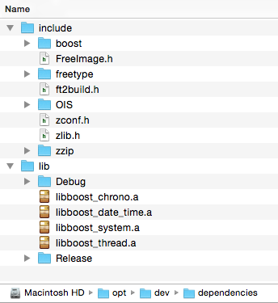

These dependencies include:

* Boost: It’s a set of open source libraries that extend the functionality of C++.
* Freeimage: it’s an Open Source library project for developers who would like to support popular graphics image formats like PNG, BMP, JPEG, TIFF and others as needed by today's multimedia applications.
* Freetype: It’s is a freely available software library to render fonts.
* OIS: It’s a code library for constructing a human-computer interface with input devices such as a keyboard, mouse or game controller.
* zlib: It’s a software library used for data compression.
* zziplib: it offers the ability to easily extract data from files archived in a single zip file.

The previous downloaded dependencies are static libraries (end up with the extension .a). Normally in other platforms when you build a library for 32 and 64 bits you end up with two different library files (one for 32 and other for 64). Here in Mac OS X, you can build for 32 AND 64 bits and you end up with a single file. That single file is what is called a “flat” binary or a “universal” binary. In order to check if a library is for 32 bits or 64 bits or both, just run the following command in a terminal:

```
/opt/dev/dependencies/lib/Release $> lipo -info libOIS.a
Architectures in the fat file: libOIS.a are: x86_64 i386
```

### Downloading and Building Ogre3D

it’s always better to use the latest stable version from the project’s repository. To do that you should use Mercurial (Mercurial is a distributed version control system). To validate if Mercurial is installed correctly, in a terminal write:

```
$> hg
Mercurial Distributed SCM
 
basic commands:
 
 add           add the specified files on the next commit
 annotate      show changeset information by line for each file
 clone         make a copy of an existing repository
 commit        commit the specified files or all outstanding changes
 diff          diff repository (or selected files)
 export        dump the header and diffs for one or more changesets
 forget        forget the specified files on the next commit
 init          create a new repository in the given directory
 log           show revision history of entire repository or files
 merge         merge working directory with another revision
 pull          pull changes from the specified source
 push          push changes to the specified destination
 remove        remove the specified files on the next commit
 serve         start stand-alone webserver
 status        show changed files in the working directory
 summary       summarize working directory state
 update        update working directory (or switch revisions)
 
use "hg help" for the full list of commands or "hg -v" for details
```

To download the Ogre3D's code, write in a terminal:

```
$> cd /opt/dev
/opt/dev/ $> hg clone https://bitbucket.org/sinbad/ogre ogre3d-1.9.0
```

The last part of the previous command (**ogre3d-1.9.0**) will be the name of the folder where the source code will be downloaded. The download process will take something like 20 minutes (although it depends of your Internet connection). 
If everything went okay, the folder should be around 460 MB:

```
opt/dev/$> du -sh /opt/dev/ogre3d-1.9.0/
461M	/opt/dev/ogre3d-1.9.0/
```

Now it's time to build Ogre3D statically (before running the cmake command, validate that your paths are consistent. After that, just build):

```
/opt/dev/ogre3d-1.9.0 $> mkdir build
/opt/dev/ogre3d-1.9.0 $> cd !$
/opt/dev/ogre3d-1.9.0/build $> cmake -DCMAKE_CXX_FLAGS="${CMAKE_CXX_FLAGS} -v -stdlib=libc++ -std=c++11" -D BOOST_ROOT=/opt/dev/dependencies/include/boost -D BOOST_INCLUDEDIR=/opt/dev/dependencies/include/boost -D BOOST_LIBRARYDIR=/opt/dev/dependencies/lib -D OGRE_DEPENDENCIES_DIR=/opt/dev/dependencies -D OGRE_STATIC=1 -D OGRE_BUILD_SAMPLES=1 -G Xcode ..
```

Here is the explanation for every parameter:

| Parameter | Description |
| :-------- | :---------- |
| CMAKE_CXX_FLAGS="${CMAKE_CXX_FLAGS} -v - | Defines support for C++11. |
| stdlib=libc++ -std=c++11” | |
| BOOST_ROOT=/opt/dev/dependencies/include/boost | Defines the location of the Boost base folder. |
| BOOST_INCLUDEDIR=/opt/dev/dependencies/include/boost | Defines the location of the Boost’s include folder. |
| BOOST_LIBRARYDIR=/opt/dev/dependencies/lib | Defines the location of the Boost’s library folder. |
| OGRE_DEPENDENCIES_DIR=/opt/dev/dependencies | Defines the location of the Ogre3D’s dependencies folder. |
| OGRE_STATIC=1 | Defines that Ogre3D will be built statically. |
| OGRE_BUILD_SAMPLES=1 | Defines that the Ogre3D’s samples will be built. |
| -G Xcode | Specify a makefile generator (Xcode in this case). |
| .. | The couple of dots indicate the location of the CMakeLists.txt file (which is the file that cmake needs to create all the make files). |	

After building Ogre3D's makefiles with CMake, look for the OGRE.xcodeproj file:

```
/opt/dev/ogre3d-1.9.0/build $> ls -l OGRE.*
OGRE.build:
total 0
drwxr-xr-x  5 USER  wheel  170 Dec  8 19:14 Debug
drwxr-xr-x  6 USER  wheel  204 Dec  8 19:22 Release
 
OGRE.xcodeproj:
total 5400
-rw-r--r--  1 USER  wheel  2763182 Dec  8 19:05 project.pbxproj
drwxr-xr-x  4 USER  wheel      136 Dec  8 19:14 project.xcworkspace
drwxr-xr-x  3 USER  wheel      102 Dec  8 19:14 xcuserdata
```

The `OGRE.xcodeproj` file is the Xcode project configuration file for the Ogre3D’s construction. Go to Finder and double click over that file. This will open Xcode.

**Note:** This tutorial will use Xcode only to build Ogre3D. Afterwards you’re not going to use it anymore.

This is what you’re going to see when Xcode opens with the Ogre3D project: 

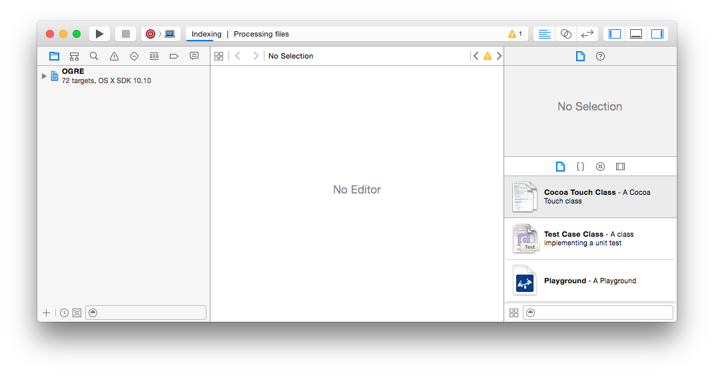

Go to `Product → Scheme → Edit Scheme..` and change the `Build Configuration` to `Release`:


Select the `install scheme` and change the `Build Configuration` to `Release``:  

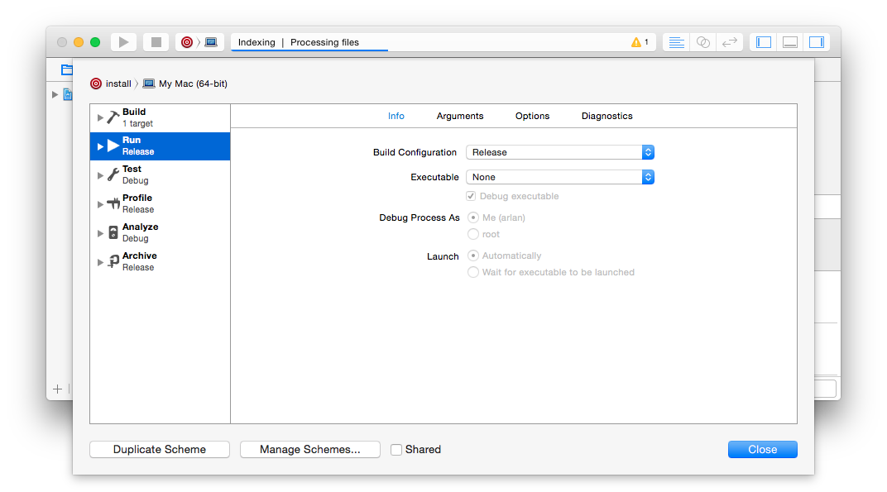

Select again the ALL_BUILD scheme: 

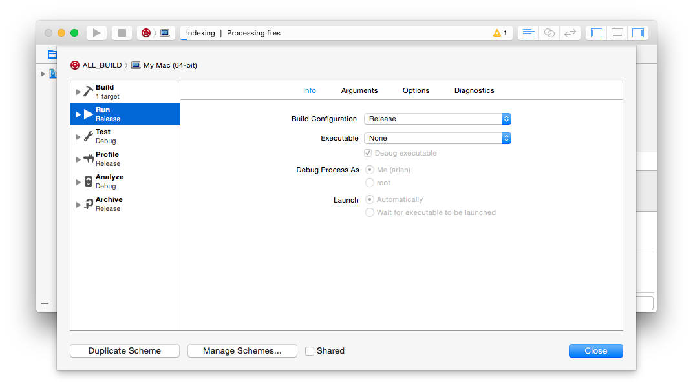

Close the dialog by clicking the `Close` button. Now in order to start the building process, in the main menu select `Product → Build` or press `Command + B`. 

To view the building log, select `View → Navigators → Show Report Navigator`. The building progress can be viewed in the blue progress bar in the Xcode’s top center window area: 

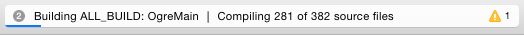

The whole building process is going to take something like 20 minutes in a computer with Processor: 1.3 GHz Intel Core i5 and Memory: 4 GB 1600 MHz DDR3. 
When the building process has finished, select `Product → Scheme → install. Then Product → Build`. 
After installing Ogre3D, you should have the following folder:

```
/opt/dev/ogre3d-1.9.0/build/ $> cd sdk
/opt/dev/ogre3d-1.9.0/build/sdk $> ls -l
total 0
drwxr-xr-x  23 USER  wheel  782 Dec 11 19:09 CMake
drwxr-xr-x  13 USER  wheel  442 Dec 11 19:09 Docs
drwxr-xr-x  13 USER  wheel  442 Dec 11 19:09 Media
drwxr-xr-x   3 USER  wheel  102 Dec 11 19:09 bin
drwxr-xr-x  12 USER  wheel  408 Dec 11 19:09 include
drwxr-xr-x  26 USER  wheel  884 Dec 11 19:09 lib
```

### Running the Ogre3D’s Samples

Now that the building process has finished you can run the Ogre3D’s samples. Open the following file in Finder:

``` /opt/dev/ogre3d-1.9.0/build/bin/Release/SampleBrowser.app ```

You should be able to see the sample browser application called SampleBrowser.app. Additionally, you can see the sample browser’s log file in the following path:

```
/Users/YOURUSERNAME/Library/Application Support/Ogre/Xalafu/ogre.log
```

### Using QtCreator

Now that Ogre3D is finally compiled, let’s take a look at the IDE that we’re going to use during this tutorial: QtCreator. This IDE includes the following features:

* Cross-platform.
* Also used for projects non-related to Qt (Qt is a cross-platform application framework).
* Visual Debugger.
* Support for CMake.
* Excellent Vim plugin.
* Good integration with tools: Git, Subversion, Mercurial.
    
**Note:** For this tutorial you don't need to download the whole Qt SDK, only the QtCreator application.

Before using QtCreator for the first time, you need to create a `Build Kits` in QtCreator (assuming that you just have installed QtCreator and don’t have any `Build Kits` configured). Open QtCreator's preferences or simply hit `Command +` . On the left panel select the `Build and Run` option: 

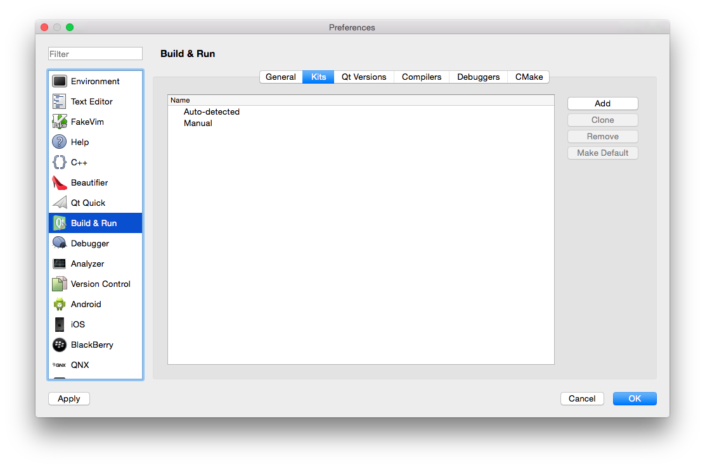

Select the `Add` button (on the upper-right side). A sub-dialog will be shown, fill the Kits name information: 

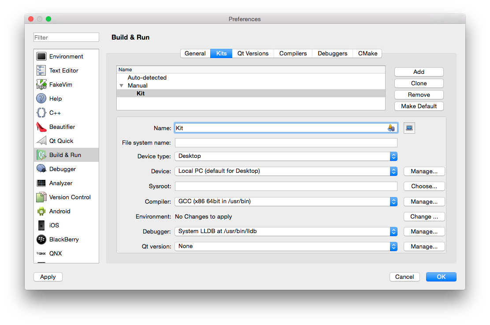

### Creating a Project (that will use CMake)

From the File menu select the option `New File` or `Project…`. You will see a dialog like this: 

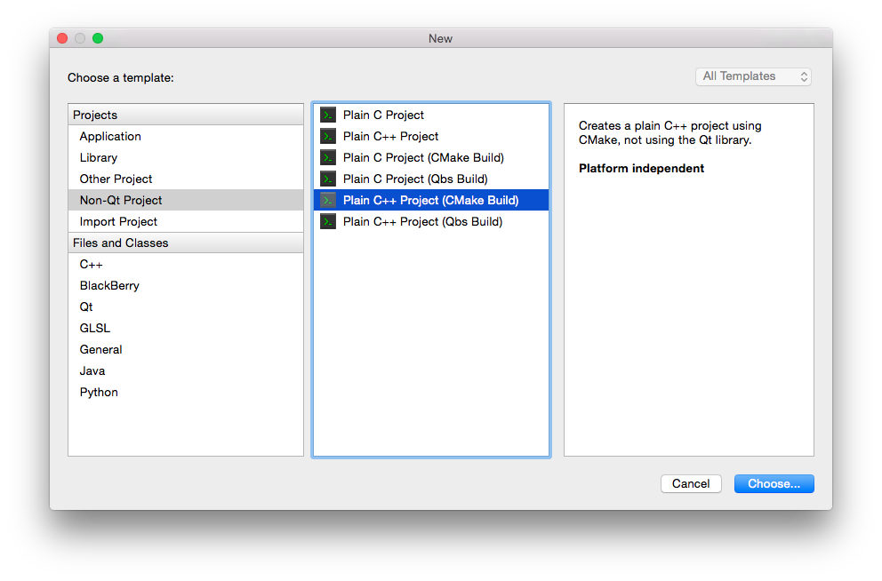

Select the option `Non-Qt Project` from the Projects list and subsequently select the `Plain C++ Project (CMake Build)` option. Afterwards click the `Choose…` button (located at the bottom-right side of the dialog). Afterwards set the project’s name and location: 

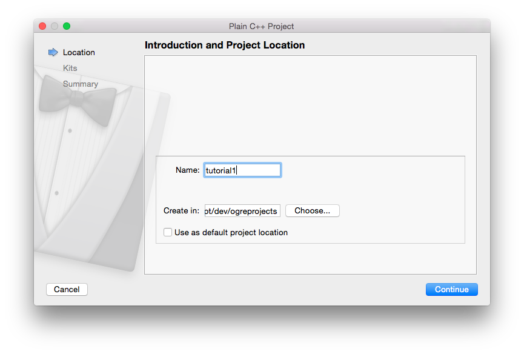

The information used for this tutorial in the previous dialog (the folder ogreprojects was created beforehand):

```
Name: tutorial1
Create in: /opt/dev/ogreprojects
```

Then click the `Continue` button. In the following dialog select a version control if you are going to use one. This tutorial won't use any: 

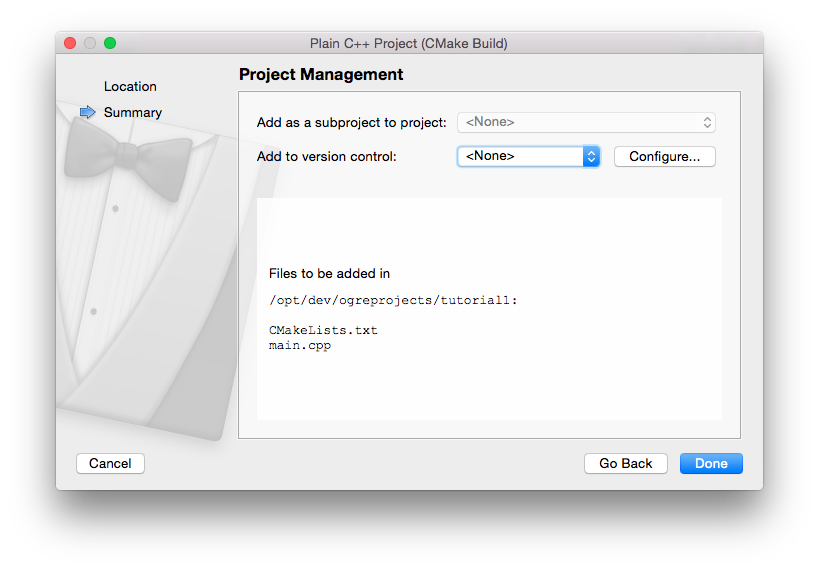

Then click the Done button. You now need to define the Build Location folder in the following dialog: 

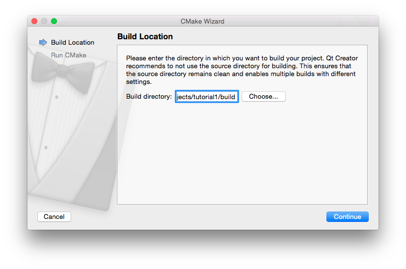

The information used for this tutorial in the previous dialog:

```/opt/dev/ogreprojects/tutorial1/build```

Click the `Continue` button. In the following dialog you will run the project’s cmake configuration file. Click the `Run CMake` button and you should see something like this: 

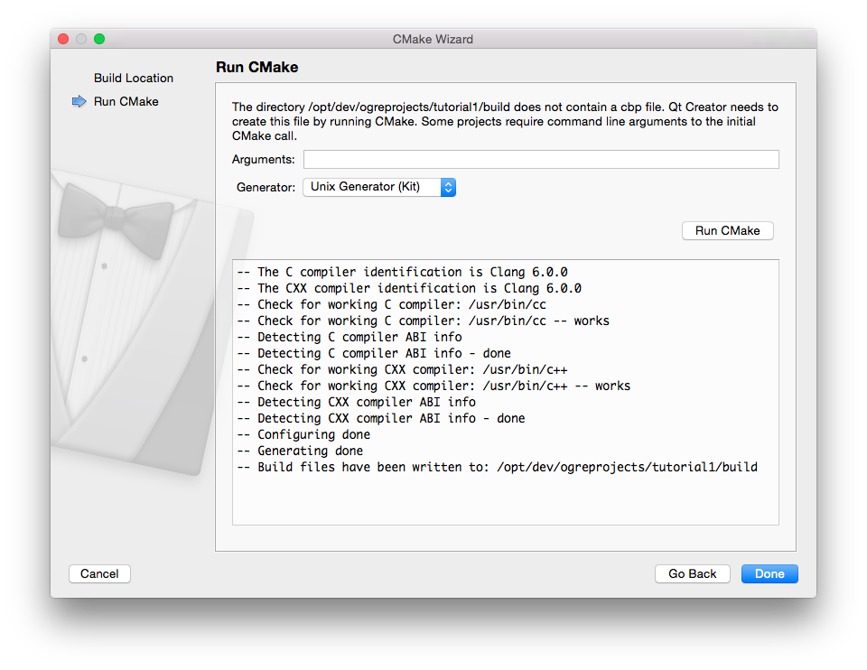

**Note:** Validate that you’re not getting any RED warnings in the previous output dialog.

Now hit the Done button and you will see the template code that QtCreator has created for you:

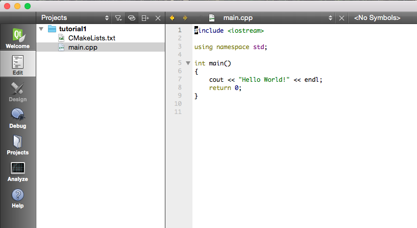

From the `Build` menu select the `Build All` option. The `Compile Output` window (located at the bottom) will tell you the building information. If everything went okay, from the `Build` menu select the `Run` option. You should see the programs output in the `Application output` (located at the bottom) window: 

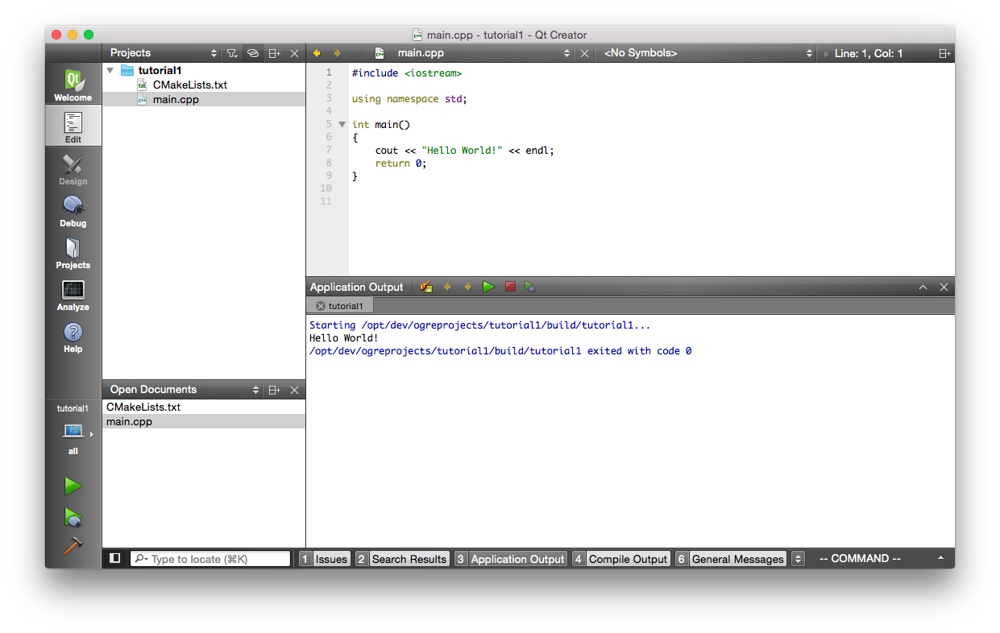

### Integrating Ogre3D in your Project

Now that you have a basic C++ project running, the idea is to integrate the Ogre3D libraries inside the project. 
Your project has two files:

* CMakeLists.txt (project configuration file)
* main.cpp (source code file)

Here is the current code for both: 

CMakeLists.txt:

```
 project(tutorial1)
 cmake_minimum_required(VERSION 2.8)
 aux_source_directory(. SRC_LIST)
 add_executable(${PROJECT_NAME} ${SRC_LIST})

```

main.cpp

```
#include <iostream>
 
using namespace std;
 
int main()
{
    cout << "Hello World" << endl;
    return 0;
}
```

Before changing anything in those files, let's reorganize the project files:

```
/opt/dev/ogreprojects/tutorial1 $> ls -l
total 40
-rw-r--r--  1 USER  wheel    329 Dec 10 21:10 CMakeLists.txt
drwxr-xr-x  9 USER  wheel    306 Dec 10 21:10 build
drwxr-xr-x  3 USER  wheel    102 Dec 10 21:09 main.cpp
 
/opt/dev/ogreprojects/tutorial1 $> mkdir src
/opt/dev/ogreprojects/tutorial1 $> mv main.cpp src/
```

Now, after performing some changes in the CMakeLists.txt file, this is how it looks like:

**Note:** CMake is case insensitive

```
PROJECT(tutorial1)
 
CMAKE_MINIMUM_REQUIRED(VERSION 2.8)
SET(CMAKE_CXX_FLAGS "${CMAKE_CXX_FLAGS} -stdlib=libc++ -std=c++11")
 
MESSAGE(STATUS ${PROJECT_SOURCE_DIR}/src)
 
FILE(GLOB_RECURSE SRCS "${PROJECT_SOURCE_DIR}/src/*.cpp")
FILE(GLOB_RECURSE HDRS "${PROJECT_SOURCE_DIR}/src/*.h")
 
ADD_EXECUTABLE(${PROJECT_NAME} ${SRCS} ${HDRS})
```

  * Line 4: This helps to activate the C++11 support.
  * Line 6: Printing the Project source dir path, only for informative purposes.
  * Line 8-9: This is the CMake way to include the source code files in your project. From now on every source code should go inside the src folder. CMake will search recursively inside this folder.
  * Line 11: This is the CMake way to say: "Create an executable using the project's source code...and name the executable file just like the project's name".
  
**Note:** Whenever you perform a change in the CMakeLists.txt file, you should re-run the CMake command.

Run the CMake command, you should see something like this:

```
-- /opt/dev/ogreprojects/tutorial1
-- Configuring done
-- Generating done
-- Build files have been written to: /opt/dev/ogreprojects/tutorial1/build
```

Build and run your project. You shouldn't get any errors.

### Binaries and App Bundles

In the terminal do:

```
$> cd /opt/dev/ogreprojects/tutorial1/build
/opt/dev/ogreprojects/tutorial1/build $> ls -l
total 144
 0 drwxr-xr-x   9 USER  wheel    306 Dec 10 21:29 .
 0 drwxr-xr-x   7 USER  wheel    238 Dec 10 21:30 ..
16 -rw-r--r--@  1 USER  wheel   6148 Dec 10 21:30 .DS_Store
56 -rw-r--r--   1 USER  wheel  26419 Dec  9 20:11 CMakeCache.txt
 0 drwxr-xr-x  13 USER  wheel    442 Dec 10 21:30 CMakeFiles
16 -rw-r--r--   1 USER  wheel   5044 Dec 10 21:29 Makefile
 8 -rw-r--r--   1 USER  wheel   1441 Dec  9 20:11 cmake_install.cmake
32 -rwxr-xr-x   1 USER  wheel  15228 Dec 10 21:10 tutorial1
16 -rw-r--r--   1 USER  wheel   5350 Dec 10 21:29 tutorial1.cbp
```

Do you see the file called `tutorial1`?, that is the project's executable (or binary). In order to execute it, in the terminal run:

```
/opt/dev/ogreprojects/tutorial1/build $> ./tutorial1
Hello World
```

The project has now an executable and you're able to run it. But things need to change a little bit in order to adapt in the Mac OS X's way of handling executables. In the Mac OS X platform you usually use what is called an `Application Bundle` (a.k.a `app bundle`). An `app Bundle` is a (special) directory that allows related resources such as an application's executable and its graphics to be grouped together, appearing as a single file to the user. 

In order for the project to create an `app bundle` instead of a plain binary, we need to change something in the CMakeLists.txt file. Change the line 11 in your CMakeLists.txt file for this one:

```
ADD_EXECUTABLE(${PROJECT_NAME} MACOSX_BUNDLE ${SRCS} ${HDRS})
```

The only difference is the addition of the `MACOSX_BUNDLE` flag to the `ADD_EXECUTABLE` command. Now run the CMake command, then Build and Run. In your `build` folder you should now see a new file called `tutorial1.app`:

```
/opt/dev/ogreprojects/tutorial1/build $> ls -l
total 144
 0 drwxr-xr-x   9 USER  wheel    306 Dec 10 21:29 .
 0 drwxr-xr-x   7 USER  wheel    238 Dec 10 21:30 ..
16 -rw-r--r--@  1 USER  wheel   6148 Dec 10 21:30 .DS_Store
56 -rw-r--r--   1 USER  wheel  26419 Dec  9 20:11 CMakeCache.txt
 0 drwxr-xr-x  13 USER  wheel    442 Dec 10 21:30 CMakeFiles
16 -rw-r--r--   1 USER  wheel   5044 Dec 10 21:29 Makefile
 8 -rw-r--r--   1 USER  wheel   1441 Dec  9 20:11 cmake_install.cmake
32 -rwxr-xr-x   1 USER  wheel  15228 Dec 10 21:10 tutorial1
 0 drwxr-xr-x   3 USER  wheel    102 Dec 10 21:47 tutorial1.app
16 -rw-r--r--   1 USER  wheel   5350 Dec 10 21:29 tutorial1.cbp
```

If you try to run the app bundle just like we run the binary previously, you will get the following error:

```
/opt/dev/ogreprojects/tutorial1/build $> ./tutorial1.app
-bash: ./tutorial1.app/: is a directory
```

If you want to run the binary from the terminal, you need to treat the app bundle as a directory (in fact it's a directory):

```
/opt/dev/ogreprojects/tutorial1/build $> cd tutorial1.app/
/opt/dev/ogreprojects/tutorial1/build/tutorial1.app $> pwd
/opt/dev/ogreprojects/tutorial1/build/tutorial1.app
/opt/dev/ogreprojects/tutorial1/build/tutorial1.app $> ls -l
total 0
drwxr-xr-x  4 USER  wheel  136 Dec 10 21:47 Contents
/opt/dev/ogreprojects/tutorial1/build/tutorial1.app $> cd Contents/; ls -l
total 8
-rw-r--r--  1 USER  wheel  986 Dec 10 21:47 Info.plist
drwxr-xr-x  3 USER  wheel  102 Dec 10 21:47 MacOS
/opt/dev/ogreprojects/tutorial1/build/tutorial1.app/Contents $> cd MacOS/; ls -l
total 32
-rwxr-xr-x  1 USER  wheel  15228 Dec 10 21:47 tutorial1
/opt/dev/ogreprojects/tutorial1/build/tutorial1.app/Contents/MacOS $> ./tutorial1
Hello World
```

**Note:** Don't worry about doing all these steps in order to run your binary every time. Wether it's a binary or an app bundle, QtCreator will take care of this and will launch your application when you select the `Run` command from the `Build` menu.

### Including Libraries in your Project

Currently this is the status of the main.cpp file:

```
#include <iostream>
 
using namespace std;
 
int main()
{
    cout << "Hello World" << endl;
    return 0;
}
```

Let's add a `Ogre::String` in order to print something else:

```
#include <iostream>
 
using namespace std;
 
int main()
{
    Ogre::String variable = "My first string using Ogre3D";
    cout << "Hello World: " << variable << endl;
    return 0;
}
```

If you try to build the previous code, you will get an error:

```
/opt/dev/ogreprojects/tutorial1/src/main.cpp:9:5: error: use of undeclared identifier 'Ogre'
    Ogre::String variable = "My frist string using Ogre3D";
    ^
1 error generated.
```

This means that the compiler is not able to find the `Ogre::String` declaration in your code. In order to fix that we need to add the libraries of Ogre3D into the project. 
This is the new CMakeLists.txt file:

```
PROJECT(tutorial1)
 
CMAKE_MINIMUM_REQUIRED(VERSION 2.8)
SET(CMAKE_CXX_FLAGS "${CMAKE_CXX_FLAGS} -stdlib=libc++ -std=c++11")
 
INCLUDE_DIRECTORIES(/opt/dev/ogre3d-1.9.0/build/sdk/include/OGRE)
LINK_DIRECTORIES(/opt/dev/ogre3d-1.9.0/build/sdk/lib)
 
FILE(GLOB_RECURSE SRCS "${PROJECT_SOURCE_DIR}/src/*.cpp")
FILE(GLOB_RECURSE HDRS "${PROJECT_SOURCE_DIR}/src/*.h")
 
ADD_EXECUTABLE(${PROJECT_NAME} MACOSX_BUNDLE ${SRCS} ${HDRS})
 
TARGET_LINK_LIBRARIES(
${PROJECT_NAME}
/opt/dev/ogre3d-1.9.0/build/sdk/lib/libOgreMainStatic.a
)
```

Changes:

* The following line was deleted because is no longer necessary:
    
``` MESSAGE(STATUS ${PROJECT_SOURCE_DIR}/src) ```

* Line 6: This line sets the location to the Ogre3D's include source code folder (this is the location where the compiler will find the definition of the Ogre::String).
* Line 7: Sets the location of the Ogre3D's libraries for the Linker (after the compilation process is done, the output is not yet a binary, it's what is called an object file. After the object file is generated by the compilation process, a special program called the Linker "links" the libraries used by the source code to the compilation's output. After that process you end up with a binary file).
* Line 14: This line allows you to link a target (the project we are creating) to the given libraries (in this case the libOgreMainStatic.a library).

If you want, you can polish a little bit more the CMakeLists.txt file:

```
PROJECT(tutorial1)
 
CMAKE_MINIMUM_REQUIRED(VERSION 2.8)
SET(CMAKE_CXX_FLAGS "${CMAKE_CXX_FLAGS} -stdlib=libc++ -std=c++11")
 
SET(OGRE_BASE_FOLDER "/opt/dev/ogre3d-1.9.0/")
SET(OGRE_INCLUDE_FOLDER "/opt/dev/ogre3d-1.9.0/build/sdk/include/OGRE")
SET(OGRE_LIB_FOLDER "/opt/dev/ogre3d-1.9.0/build/sdk/lib")
 
INCLUDE_DIRECTORIES(${OGRE_INCLUDE_FOLDER})
LINK_DIRECTORIES(${OGRE_LIB_FOLDER})
 
FILE(GLOB_RECURSE SRCS "${PROJECT_SOURCE_DIR}/src/*.cpp")
FILE(GLOB_RECURSE HDRS "${PROJECT_SOURCE_DIR}/src/*.h")
 
ADD_EXECUTABLE(${PROJECT_NAME} MACOSX_BUNDLE ${SRCS} ${HDRS})
 
TARGET_LINK_LIBRARIES(
${PROJECT_NAME}
${OGRE_LIB_FOLDER}/libOgreMainStatic.a
)
```    

Now go the main.cpp and add this line after the inclusion of the iostream library :

```#include <OgreString.h>```

You should have a main.cpp file like this:

```
#include <iostream>
#include <OgreString.h>
 
using namespace std;
 
bool start();
 
int main()
{
    Ogre::String variable = "My first string using Ogre3D";
    cout << "Hello World: " << variable << endl;
    return 0;
}
```

When you included the previous line (`#include ‹OgreString.h`), the QtCreator IDE should be able to find the definition of the Ogre::String. To validate if it's true, the `Ogre::string` type should be colored in a purple tone: 

```
int main()
{
    Ogre::String variable = "My first string using Ogre3D";
    cout << "Hello World: " << variable << endl;
    return 0;
}
```

Now run the `CMake` command, then `Build` and `Run`. Everything should be working fine: 

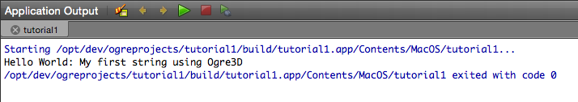

**Note:** From the previous image you can tell that QtCreator is using the app bundle.

### Final Thoughts

Now that you're able to create a project in QtCreator using CMake and Ogre3D, you are now ready to continue with the tutorials ([Ogre3D's Tutorials](http://www.ogre3d.org/tikiwiki/tiki-index.php?page=Tutorials)). Additionally you should take care of the following:

* Most of the tutorials in the Wiki use the Ogre3D's SDK (which is compiled dynamically) or the Ogre3D project compiled dynamically (not statically like this tutorial). Be aware that the plugins using Ogre3D statically are loaded in a different way. These links will help you to begin:    
        [Static Linking](http://www.ogre3d.org/tikiwiki/tiki-index.php?page=StaticLinking).    
        [OgreStaticPluginLoader](https://bitbucket.org/sinbad/ogre/src/14b115a54ba1/Samples/Common/include/OgreStaticPluginLoader.h)

* When you are going to create the window that will render your scene, be aware to set the `macAPI` flag in the `additionalParameters` when calling the `createRenderWindow` method:

```
Ogre::String windowTitle = "Blank Window";
unsigned int windowSizeX = 1600;
unsigned int WindowSizeY = 1000;
bool isFullscreen = false;
 
Ogre::NameValuePairList additionalParameters;
// ... setting other additional parameters
additionalParameters[ "macAPI" ] = "cocoa";
Ogre::Root *root = new Ogre::Root( Ogre::StringUtil::BLANK );
Ogre::RenderWindow* renderWindow = root->createRenderWindow( windowTitle, windowSizeX, WindowSizeY, isFullscreen, &additionalParameters );
```

* When working with the Tutorials, at some point you're going to add some resource files to your Ogre3D's project. These files need to be inside the app bundle of your project (so the binary is capable of finding them). To give you some idea about how to do that in CMake, these lines will help you:

```
FILE(GLOB COPY_RESOURCES ${PROJECT_SOURCE_DIR}/resources/*.cfg)
FILE(GLOB COPY_RESOURCES1 ${PROJECT_SOURCE_DIR}/resources/resources.cfg)
FILE(COPY ${COPY_RESOURCES} DESTINATION ${PROJECT_SOURCE_DIR}/build/YOUR_NAMES_APPLICATION.app/Contents/MacOS)
FILE(COPY ${COPY_RESOURCES} DESTINATION ${PROJECT_SOURCE_DIR}/build/YOUR_NAMES_APPLICATION.app/Contents/Resources)
```

* If you're going to include a system library in your project, like Cocoa or OpenGL, you can do that in CMake like this:

```
MESSAGE(STATUS "Looking for system frameworks")
 
FIND_LIBRARY(COCOA_LIB Cocoa)
IF(NOT COCOA_LIB)
    MESSAGE(FATAL_ERROR "Cocoa framework not found")
ELSE()
    MESSAGE(STATUS "Cocoa framework found. Location: " ${COCOA_LIB})
ENDIF()
 
FIND_LIBRARY(OPENGL_LIB OpenGL)
IF(NOT OPENGL_LIB)
    MESSAGE(FATAL_ERROR "OpenGL framework not found")
ELSE()
    MESSAGE(STATUS "OpenGL framework found. Location: " ${OPENGL_LIB})
ENDIF()
```

* The render loop in Mac OS X cannot be done in the traditional way (the way it's explained in the tutorials - using a while render loop). The reason is this (I'm quoting form one of the forum posts):

> "Cocoa dispatches events differently than Carbon or Win32. You don't pump messages, instead you wait for them to be delivered to you. If you are running a never ending loop for rendering and events handling, your app never has a chance for those events to be delivered to it. Which is why it is hanging. Check out SampleBrowser_OSX.h to see an example of using renderOneFrame with Cocoa."

You can find more information in the following posts:

[64 Bit Cocoa (Mac) Ogre doesn't respond?](http://www.ogre3d.org/forums/viewtopic.php?f=2&t=70415)  
[Ogre Hangs in main loop](http://www.ogre3d.org/forums/viewtopic.php?f=2&t=68804)

* There is an open source project called OpenEngine(external link). This project can help you to find out how other persons are programming with Ogre3D.

Okay, that's it. If you have any doubt please consult the forum ([Ogre3D Forum](http://www.ogre3d.org/forums/)).


