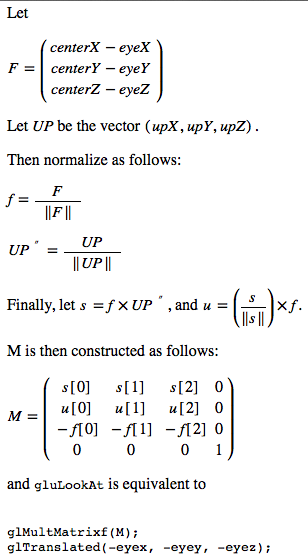
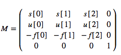

# OpenGL视图变换深入理解

## 通过`gluLookAt()`函数深入理解OpenGL视图变换

```
void gluLookAt(	GLdouble eyeX, GLdouble eyeY, GLdouble eyeZ,           // Specifies the position of the eye point.      相机位置
   	            GLdouble centerX, GLdouble centerY, GLdouble centerZ,  // Specifies the position of the reference point.参考点
   	            GLdouble upX, GLdouble upY, GLdouble upZ);             // Specifies the direction of the up vector.     上方向
``` 	              


`gluLookAt()`函数用于定义视图变换。深入学习该函数有助于理解OpenGL的模型视图变换。先看[官方说明](https://www.opengl.org/sdk/docs/man2/xhtml/gluLookAt.xml)：


> gluLookAt creates a viewing matrix derived from an eye point, a reference point indicating the center of the scene, and an UP vector.
> 
> The matrix maps the reference point to the negative z axis and the eye point to the origin. When a typical projection matrix is used, the center of the scene therefore maps to the center of the viewport. Similarly, the direction described by the UP vector projected onto the viewing plane is mapped to the positive y axis so that it points upward in the viewport. The UP vector must not be parallel to the line of sight from the eye point to the reference point.

##### 解读官方描述：

`gluLookAt` 使用视点、指出场景中心的参考点和上方向向量这三个参数创建了一个视图矩阵。

该矩阵的效果为：参考点(`center`)位于z轴负方向，视点(`eye`)位于原点，参考点和视点共同确定了相机坐标的z轴；当使用普通的投影矩阵(我估计就是正交投影和透视投影吧)时，场景的中心点(`center`)将被渲染到视口的中心，确定了裁切面；上方向向量在观察平面(xoy平面)上的投影 所确定的方向被映射为正y轴，从而令它指向视口上方。特别强调的是，向上矢量不可以与视线(从视点到参考点的连线)平行，否则上方向向量将无效。

##### 函数操作流程



##### 解读操作流程

1. 将参考点与视点的连线构成的向量归一化得到 `f`，即相机坐标系的z轴
2. 将上方向向量归一化得到 `UP*`
3. 叉乘`f`和`UP*`可以得到s，即相机坐标系的x轴
4. 叉乘`f`和`s`可以得到`u`，即相机坐标系的y轴
5. 经过以上步骤，可以构建一个矩阵M：



`gluLookAt`函数等价与以下操作：

```
glMultMatrixf(M); // 当前矩阵右乘旋转矩阵M
glTranslated(-eyex, -eyey, -eyez); // 反向平移
```

##### 注意点：

1. 由于矩阵操作从右往左，所以该函数其实是先平移后旋转，顺序不能交换
2. `gluLookAt`建立的相机坐标系是以视线方向作为眼坐标系的-Z方向，这是规定，是整个相机坐标系构建的基准
3. 由于`UP*`不一定跟`f`(即相机坐标系的z轴)垂直，故需要修正到与Z轴垂直，即将`UP*`向量分解取其与视线方向相垂直的一部分，而不是直接指定为`UP*`

参考实现代码如下：

```
void GLAPIENTRY
gluLookAt(GLdouble eyex, GLdouble eyey, GLdouble eyez, GLdouble centerx,
      GLdouble centery, GLdouble centerz, GLdouble upx, GLdouble upy,
      GLdouble upz)
{
    float forward[3], side[3], up[3];
    GLfloat m[4][4];
    
    /* center - eye，并规范化，得到相机坐标系负z轴 */
    forward[0] = centerx - eyex;
    forward[1] = centery - eyey;
    forward[2] = centerz - eyez;
    normalize(forward);
    
    /* UP向量 */
    up[0] = upx;
    up[1] = upy;
    up[2] = upz;
 
    
    /* Side = forward x up，获得垂直于forward 和 up所在平面的单位向量，即为相机坐标系x轴*/
    cross(forward, up, side);
    normalize(side);
 
    /* Recompute up as: up = side x forward 
     * 修正up向量，令up垂直于side 和 forward所在平面，即为最终的相机坐标系y轴
     */
    cross(side, forward, up);
    
    
    /* 运用up, side, forward三个单位正交基构建旋转矩阵M，以下以首字母示意up, side, forward
     *        /  s[0]   s[1]  s[2] \
     *  M =  |   u[0]   u[1]  u[2]  |
     *        \ -f[0]  -f[1] -f[2] /
     */
    __gluMakeIdentityf(&m[0][0]);
    m[0][0] = side[0]; m[1][0] = side[1]; m[2][0] = side[2];
    m[0][1] = up[0]; m[1][1] = up[1]; m[2][1] = up[2];
    m[0][2] = -forward[0]; m[1][2] = -forward[1]; m[2][2] = -forward[2];
    
    /*  数据准备完毕，执行操作 
     *  假设当前矩阵为C，则执行操作后当前矩阵变为：C*M*T
     *  根据矩阵乘法从右到左原则，且相机始终不运动(运动的是世界坐标系)，该函数：
     *  1. 世界坐标系 反向 平移eye向量
     *  2. 以M为旋转矩阵做旋转变换
     */
    glMultMatrixf(&m[0][0]);
    glTranslated(-eyex, -eyey, -eyez);
}
```
