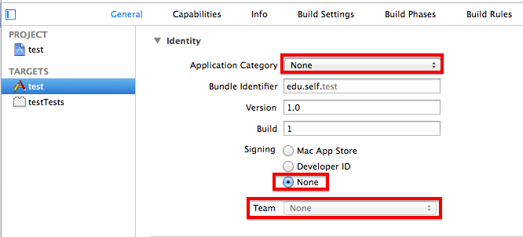
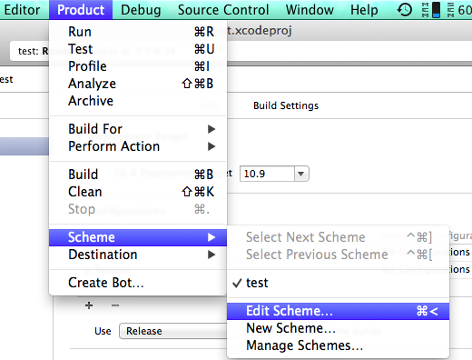
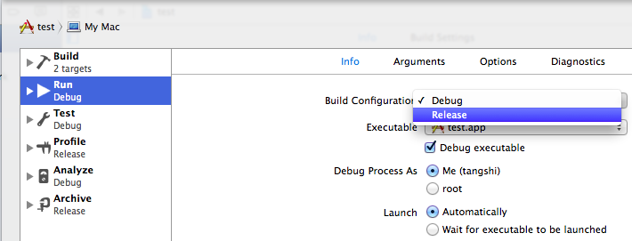
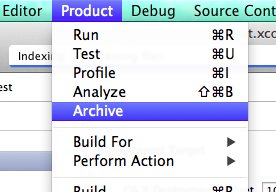
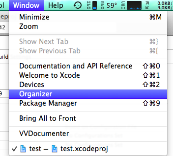
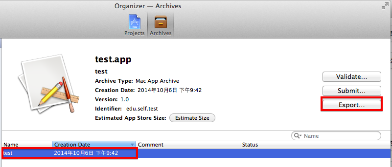
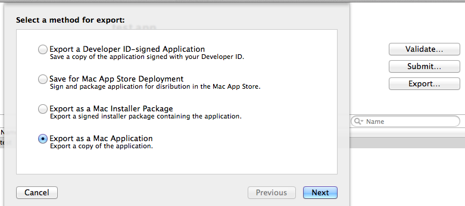

# Xcode打包app/

### 0. 清除开发者身份信息

没开发者账户的必须清除开发者身份信息，否则无法打包，具体如下图所示，注意红色方框：

### 1. 更改编译类型

你可能需要更改编译类型，因为发布作品的话，我们往往是编译成`Release`，而不是`Debug`。
你只需要执行以下两步：

`Product -> Scheme -> Edit Scheme...`

`Run -> Build Configure -> Release`

更改完成。

### 2. 打包程序

这个更简单，只需要一步：

`Product -> Archive`

### 3. 导出

打包完成后，`Xcode`会自动跳转到`Organizer`窗口，如果你不小心关闭了，还可以通过`Winddow -> Organizer`打开。

在`Organizer`窗口，找到并选中你刚刚打包的程序，点击`Export`导出

一般我们选择`Export as a Mac Application`

### 4. 完成！