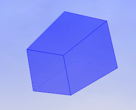

# ManualObject [译]

####  使用代码简单创建自定义2D/3D物体的类



`ManualObject` 是一个使用代码创建自定义2D/3D物体的类。They can be created and modified "on the fly".

### Table of contents    
* 3D物体的快速教程 
* 如何创建一个三维物体(用代码)
* `ManualObject`基础   
* 注意事项
* 例子   
   * 例 1    
   * 例 2    
   * 例 3    
* 高级操作
* 渲染类型
* 细节
* 修改
    * BeginUpdate() - API 描述
* See also

### 3D物体的快速教程 
- - - - -
这部分摘自[Intermediate Tutorial 4](http://www.ogre3d.org/tikiwiki/tiki-index.php?page=Intermediate+Tutorial+4).   
> 在开始直接深入学习创造mesh之前，谈谈什么是mesh以及mesh是由什么组成的可能挺有用的。这是个很粗糙的简介，一个mesh由两部分组成：顶点缓存(Vertex buffers)和索引缓存(Index buffers)。


> **顶点缓存(Vertex buffers)** 定义了三维空间中的点。顶点索引中的每个元素是由你设定的若干个属性定义的。唯一一个你必须设置的属性是该顶点的位置(position)。除此之外，你还有若干个可选的属性，比如顶点的颜色、纹理坐标等等。具体需要使用哪些属性有赖于你想用mesh做什么事情。

> **索引缓存(Index buffers)** 通过选取顶点索引中的点来“连接”各个顶点。索引缓存中的每三个索引定义一个用于GPU绘制的的三角面片。你在索引缓存中选取顶点的顺序告诉图形卡三角面片的朝向。逆时针绘制的三角面片是朝向你的，顺时针绘制的三角面片则是背向你的，通常情况只需要绘制正面就可以了。所以确认你的三角面片是否正确配置非常重要。

> 虽然所有mesh都有顶点缓存，但不是所有mesh都有索引缓存。比如，我们接下来要创建的mesh就没有索引缓存，因为我们想创建一个空长方形(与填充长方形(filled rectangle)相对)。最后，注意顶点缓存和索引缓存通常存储在video card内存中，所以你的软件只能给video card发送一组简单的、离散的指令集来告诉它使用那些预先定义过的缓存来一次性渲染一个完整的3D mesh。
  
### How to create 3D objects (by code)   
- - - - -
这部分摘自[Intermediate Tutorial 4](http://www.ogre3d.org/tikiwiki/tiki-index.php?page=Intermediate+Tutorial+4).

> 在Ogre中手动创建mesh的方式有两种。第一种是子类化`SimpleRenderable`物体并直接为它提供顶点缓存和索引缓存索引。这是最直接的方式，但是也是最复杂的方式。[Generating A Mesh](http://www.ogre3d.org/tikiwiki/tiki-index.php?page=Generating+A+Mesh) 这个代码片段展示了使用这种方式的一个例子。   
> 为了更简单，Ogre提供了一个更好的名为`ManualObject`的接口，它允许你使用一些简单地函数去定义mesh而不是直接写入缓存的原始数据。你可以简单地调用`position`和`colour`函数而不是将position、colour等数据写入缓存中。

### ManualObject基础
- - - - 
使用ManualObject，你无需载入资源，用它来创建动态的或者简单的物体是很好的。   
你通过定义需要的定点，渲染类型(点、线、面)、赋予材质来创建mesh。但是你必须将它绑定在场景节点(比如RootSceneNode)上它才可以被添加到场景中。   
ManualObjects是由`sections`组成的(类似于mesh中的submesh)。每个section是一个定义块`begin() ...content... end()`。通常一个section就足够了。   
如果你定义了不止一个section，那么每个section可以使用独立的材质和渲染类型。因此你可以创建一个包含线、面或者结合使用线、面的ManualObject。透明也是可以实现的(使用带透明属性的材质)。   
若需要使用ManualObject的多个实例(拷贝)，你可以创建多次，或者使用`ManualObject::convertToMesh()`将ManualObject转为Mesh。Mesh可以被多次载入场景(成为Entity)。使用`convertToMesh()`的另一个优点是，你可以给一个形状应用不同的材质。   
*identity projection*在某些情况下非常有趣。使用它时当前相机的坐标是2维的，在overlay渲染时这非常有用。

### 注意事项
- - - - 
- 如果你想将ManualObject转为Mesh，只定义position是不够的。你还需要定义索引。
- 类似的，如果你希望生成切向量同样需要定义索引。
- 为了反射效果更好，你需要计算每个顶点的法向量。
- 使用纹理时，你必须计算每个顶点的UV坐标。
- 避免创建过多section，而内容只有一点点(比如每个section只定义一个三角形)。这会影响性能。(原则上，保证每个section有不少于30个三角形)

### 例子
- - - -
#####   例 1    
- - - -
一个最小的例子，在3维空间汇总创建一条**线(line)**。

```c++
// create ManualObject
ManualObject* manual = mSceneMgr->createManualObject("manual");
 
// specify the material (by name) and rendering type
manual->begin("BaseWhiteNoLighting", RenderOperation::OT_LINE_LIST);
 
// define start and end point
manual->position(-100, -100, -100);
manual->position(100, 100, 100);
 
// tell Ogre, your definition has finished
manual->end();
 
// add ManualObject to the RootSceneNode (so it will be visible)
mSceneMgr->getRootSceneNode()->attachObject(manual);
```

#### 例 2    
- - - -
这个例子给出了一个**正方形(square)**的轮廓：

```c++
ManualObject* manual = mSceneMgr->createManualObject("manual");
manual->begin("BaseWhiteNoLighting", RenderOperation::OT_LINE_STRIP);
 
manual->position(-100.0, -100.0, 0.0);  // start position
manual->position( 100.0, -100.0, 0.0);  // draw first line
manual->position( 100.0,  100.0, 0.0);
manual->position(-100.0,  100.0, 0.0);
manual->position(-100.0, -100.0, 0.0);  // draw fourth line
 
manual->end();
mSceneMgr->getRootSceneNode()->createChildSceneNode()->attachObject(manual);
```

#####   例 3    
- - - -
这个例子与前一个类似，但是使用了**索引(indexes)**。   
区别:

- 顶点位置和使用顺序分离
- 顶点位置可以更新或修改而不需要重新构建整个ManualObject
- 若你想转为Mesh，你需要定义索引。

```c++
ManualObject* manual = mSceneMgr->createManualObject("manual");
manual->begin("BaseWhiteNoLighting", RenderOperation::OT_LINE_STRIP);
 
// define vertex position of index 0..3
manual->position(-100.0, -100.0, 0.0);
manual->position( 100.0, -100.0, 0.0);
manual->position( 100.0,  100.0, 0.0);
manual->position(-100.0,  100.0, 0.0);
 
// define usage of vertices by refering to the indexes
manual->index(0);
manual->index(1);
manual->index(2);
manual->index(3);
manual->index(0);
 
manual->end();
mSceneMgr->getRootSceneNode()->createChildSceneNode()->attachObject(manual);
```

### 高级操作
- - - -
当你想要**移动(move)**, **旋转(rotate)**, **缩放(scale)**或者暂时**隐藏(invisible)**ManualObject时，将它绑定到专门的场景节点上。   
下面是一个移动操作的例子：     

```c++
SceneNode mySceneNode = mSceneMgr->getRootSceneNode()->createChildSceneNode("mySceneNode");
 
// attach ManualObject
mySceneNode->attachObject(manual);
 
// move it
mySceneNode->setPosition(0, 10, 0);
```

如果你想将ManualObject约束为一个movableObject，就把ManualObject(或者它的专用节点)绑定在一个movableObject的场景节点上。(If you want to clamp the ManualObject to a movable object (e.g. a vehicle), just attach the ManualObject (or its dedicated SceneNode) to the SceneNode of the movable object.)

### 渲染类型
- - - -
`enum Ogre::RenderOperation::OperationType`

|  Operation Type    |  meaning        |  argument     |
|:------------------ |:--------------- | ------------- |
| `OT_POINT_LIST`    | A list of points |1 vertex per point |
| `OT_LINE_LIST`     | A list of lines  |2 vertices per line |
| `OT_LINE_STRIP`    | A strip of connected lines | 1 start vertex and 1 vertex per line |
| `OT_TRIANGLE_LIST` | A list of triangles | 3 vertices per triangle |
| `OT_TRIANGLE_STRIP`| A strip of triangles | 3 vertices for the first triangle and 1 per triangle after that |
| `OT_TRIANGLE_FAN`  | A fan of triangles | 3 vertices for the first triangle and 1 per triangle after that |

**Triangle Strip:**   
triangle strip是一系列连结的三角形，它们共享顶点，使渲染更快，内存使用更小。它们在大多数图形卡上可以得到优化。更多细节你可以在[Wikipedia page](http://en.wikipedia.org/wiki/Triangle_strip)上找到。


**Triangle Fan:**   
triangle fan 描述了一个共享一个中心顶点的三角形的几何。更多细节你可以在[Wikipedia page](http://en.wikipedia.org/wiki/Triangle_fan)上找到。    
使用triangle strip 或者 triangle fan你只需要N+2个顶点来描述N个三角形(而不是3N个分别定义的三角形)。


**Points:**
一个点的大小维一个像素，与它到相机的距离无关。点的大小可以在**材质(material)设置**中更改。Use[`Material::setPointSize()`](http://www.ogre3d.org/docs/api/html/classOgre_1_1Material.html#a8c26b7ccb050d96cd031db31bf996b48)
for the whole material or more differentiated [`Technique::setPointSize()`](http://www.ogre3d.org/docs/api/html/classOgre_1_1Technique.html#a1b7d1d264b34c50b7606c646415a50e8) or [`Pass::setPointSize()`](http://www.ogre3d.org/docs/api/html/classOgre_1_1Pass.html#a2b0cfe1d55b1c03e59c4e3f546d2ec78). 

It's also possible to render the line thickness dependent to the distance. For details look to [setPointAttenuation](http://www.ogre3d.org/docs/api/html/classOgre_1_1Pass.html#a0d44f9c4a2e69fd31a4687ffe2b8335d), [setPointMinSize](http://www.ogre3d.org/docs/api/html/classOgre_1_1Pass.html#a75a3e18e0d2c3e7f51a47cedcec0246c), [setPointMaxSize](http://www.ogre3d.org/docs/api/html/classOgre_1_1Pass.html#a463b59eaa324934370441a98b8b619b3) and 
[setPointSpritesEnabled](http://www.ogre3d.org/docs/api/html/classOgre_1_1Pass.html#a9683c2f40ed7c96b708eb2db5e02c842) of the Pass class.

**注意:**

- 对于大型ManualObject，建议使用**索引(indices)**。这能减少顶点缓存中的冗余顶点。
- **Strips and fans** (without index)，也能减少顶点冗余，但是有缺点：need one batch for each strip。这**对性能不利**，特别是当小strip很多时。当你需要节省GPU内存时请考虑到这点。(Calculation example for 1000 triangles: Needs ~100KB as strip/fan or ~300KB as triangle list)

### 细节
- - - -
Building one-off geometry objects manually usually requires getting down and dirty with the vertex buffer and vertex declaration API, which some people find a steep learning curve. This class gives you a simpler interface specifically for the purpose of building a 3D object simply and quickly. Note that if you intend to instance your object you will still need to become familiar with the Mesh class.   

This class draws heavily on the interface for OpenGL immediate-mode (glBegin, glVertex, glNormal etc), since this is generally well-liked by people. There are a couple of differences in the results though - internally this class still builds hardware buffers which can be re-used, so you can render the resulting object multiple times without re-issuing all the same commands again. Secondly, the rendering is not immediate, it is still queued just like all OGRE objects. This makes this object more efficient than the equivalent GL immediate-mode commands, so it's feasible to use it for large objects if you really want to.   

To construct some geometry with this object:

* 如果你知道大致有多少顶点(和索引，如果有用索引)，调用` 	estimateVertexCount (size_t vcount)`和`estimateIndexCount (size_t icount)`。这虽然没有实际效果，但是可以节省内存重分配的次数。
* 调用 begin() to 开始输入(entering)数据
* 对每个顶点，调用`position()`, `normal()`, `textureCoord()`, `colour()` 来定义你的顶点数据。**注意：**
    * 每次调用`position()`就产生一个新顶点；
    * 第一个顶点决定来顶点的构成元素：即，定义完第一个顶点后你不能再添加顶点元素。例如，第一个顶点你没有调用`normal()`，你就不能在其它任何顶点调用它.
* If you want to define triangles (or lines/points) by indexing into the vertex list, you can call `index()` as many times as you need to define them. If you don't do this, the class will assume you want triangles drawn directly as defined by the vertex list, i.e. non-indexed geometry. Note that stencil shadows are only supported on indexed geometry, and that indexed geometry is a little faster; so you should try to use it.
* 调用`end()`结束输入数据。
* Optionally repeat the begin-end cycle if you want more geometry using different rendering operation types, or different materials After calling `end()`, the class will organise the data for that section internally and make it ready to render with. Like any other MovableObject you should attach the object to a SceneNode to make it visible. Other aspects like the relative render order can be controlled using standard MovableObject methods like setRenderQueueGroup.   

你可以使用`beginUpdate()`修改几何体。如果这么做，你需要在你第一次调用`begin()`之前调用`setDynamic(true)`，并且考虑调用`estimateVertexCount()` 和 `estimateIndexCount()`如果你的几何体将会“成长”，以此避免缓存的重创建。   

注意，就像虽有的OGRE 几何体，指定三角形时应该使用逆时针方向(whether you're doing it with just vertices, or using indexes too)，也就是说，顶点按逆时针顺序列出的是外表面。

### 修改
- - - -
ManualObject可以被修改和拓展。
如上所述，一个ManualObject可以包含多个section(`begin(), ...add content..., end()`)。要添加更多顶点，只需增加一个section，使用`begin()`要修改一个section，使用`beginUpdate()`。

#####   BeginUpdate() - API 描述
- - - -
`void Ogre::ManualObject::beginUpdate(size_t sectionIndex)`   
开始物体某部分的一个更新的定义。

**备注:** 使用这个方法，你可以更新物体已有的section。显然，你不能改变操作类型，因为需要和之前使用的匹配。

**注意:** 如果你的section的尺寸会改变，尤其是会增大，那么，使用`estimateVertexCount()`和 `estimateIndexCount()` 去预定义一个略大于初始大小的缓存已避免缓存的重构。

**参数-sectionIndex:** 你想要更新的section的索引。第一次调用`begin()`创建了section 0，第二次创建了section 1，以此类推.


### See also
- - - -
* [Class reference for ManualObject](http://www.ogre3d.org/docs/api/html/classOgre_1_1ManualObject.html)
* 其它 ManualObject 例子: [Line3D](http://www.ogre3d.org/tikiwiki/tiki-index.php?page=Line+3D), [DynamicLineDrawing](http://www.ogre3d.org/tikiwiki/tiki-index.php?page=DynamicLineDrawing), [Circle3D](http://www.ogre3d.org/tikiwiki/tiki-index.php?page=Circle3D), [ManualObject 2D](http://www.ogre3d.org/tikiwiki/tiki-index.php?page=ManualObject+2D)
* MOGRE: [Line 3D](http://www.ogre3d.org/tikiwiki/tiki-index.php?page=MOGRE+Line+3D), [Create Tetrahedron](http://www.ogre3d.org/tikiwiki/tiki-index.php?page=Create+Tetrahedron+with+MOGRE), [Generating a grid](http://www.ogre3d.org/tikiwiki/tiki-index.php?page=MOGRE+GeneratingAGrid)
* [MadMarx Tutorial 3](http://www.ogre3d.org/tikiwiki/tiki-index.php?page=MadMarx+Tutorial+3) - ManualObject Quad
* [MadMarx Tutorial 4](http://www.ogre3d.org/tikiwiki/tiki-index.php?page=MadMarx+Tutorial+4) - ManualObject to Mesh
* Important remarks are in its [API description of ManualObject](http://www.ogre3d.org/docs/api/html/classOgre_1_1ManualObject.html#_details)
* API description of [convertToMesh()](http://www.ogre3d.org/docs/api/html/classOgre_1_1ManualObject.html#657275e617d9558951a3037f02b07efe)
* API description of [SimpleRenderable](http://www.ogre3d.org/docs/api/html/classOgre_1_1SimpleRenderable.html)
* API description of [identity projection](http://www.ogre3d.org/docs/api/html/classOgre_1_1ManualObject.html#7f832d5605c489db7be396ec7cd20b85)
* [Ogre Procedural Geometry Library](http://www.ogre3d.org/tikiwiki/tiki-index.php?page=Ogre+Procedural+Geometry+Library) - A library to quickly create geometric primitives
* [DynamicLineDrawing](http://www.ogre3d.org/tikiwiki/tiki-index.php?page=DynamicLineDrawing) - create a line by the class SimpleRenderable, which can be modified with better performance (e.g. change size of a circle)
* [Debug Drawing Utility Class](http://www.ogre3d.org/tikiwiki/tiki-index.php?page=Debug+Drawing+Utility+Class)
* [Read raw data from ManualObject - MOGRE](http://www.ogre3d.org/tikiwiki/tiki-index.php?page=Read+raw+data+from+ManualObject+-+MOGRE)
* [TerrainMeshDecal](http://www.ogre3d.org/tikiwiki/tiki-index.php?page=TerrainMeshDecal) - ManualObject example: Using a mesh decal to show a marker on the terrain for terrain selection
* [Generating A Mesh](http://www.ogre3d.org/tikiwiki/tiki-index.php?page=Generating+A+Mesh) - creating a mesh in memory using an index and vertex buffe